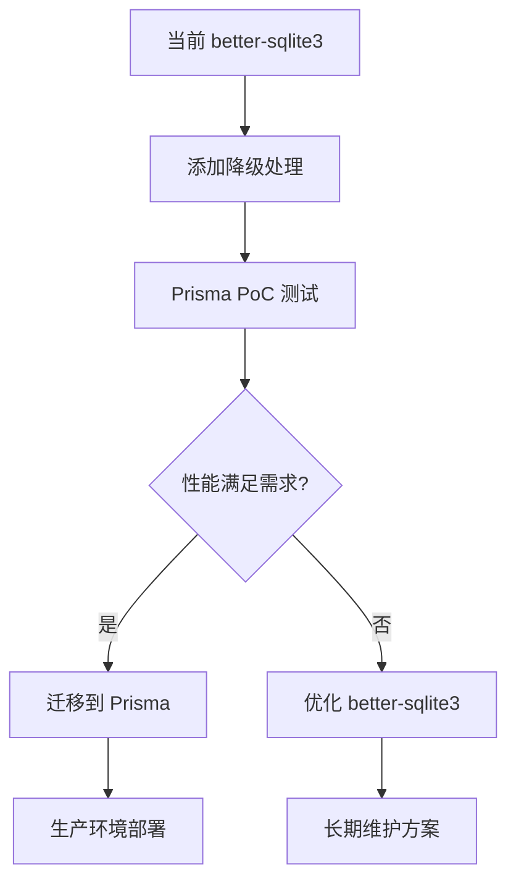

# npm安装问题排查与解决记录

## 问题描述
在执行 `npm install` 时遇到安装失败，错误主要出现在 `postinstall` 脚本阶段。

## 错误表现
1. npm install 执行失败，退出码为1
2. 错误发生在 `electron-builder install-app-deps` 阶段
3. 涉及原生依赖包：`better-sqlite3@12.4.1` 和 `sqlite3@5.1.7`
4. node-gyp 无法找到Visual Studio构建工具

## 问题分析

### 根本原因
1. **原生依赖编译问题**: Electron项目中的原生模块需要针对Electron的Node.js版本重新编译
2. **构建工具配置问题**: node-gyp在Windows上需要Visual Studio构建工具，但配置不正确
3. **postinstall脚本执行顺序问题**: 直接执行npm install时，postinstall脚本尝试在依赖安装完成前就重新编译原生模块

## 解决步骤

### 第一步：绕过postinstall脚本
```bash
npm install --ignore-scripts
```
**目的**: 先安装所有依赖包，但不执行postinstall脚本，避免原生编译错误

### 第二步：手动重建Electron原生依赖
```bash
set GYP_MSVS_VERSION=2019 && npx electron-rebuild --force
```
**关键点**:
- 设置环境变量 `GYP_MSVS_VERSION=2019` 指定Visual Studio版本
- 使用 `--force` 强制重新编译所有原生模块
- `electron-rebuild` 会自动为当前Electron版本编译原生模块

### 第三步：验证安装结果
```bash
npm run dev
```
**检查项**:
- Vite开发服务器是否正常启动 (http://localhost:5173)
- Electron应用是否正常启动
- 原生模块是否能正常加载

## 备选方案

### 方案A：如果electron-rebuild失败
```bash
# 单独重新编译问题模块
npm rebuild better-sqlite3 sqlite3
# 或者
npx node-gyp rebuild --directory=node_modules/better-sqlite3
```

### 方案B：使用预编译二进制文件
在package.json中添加：
```json
{
  "dependencies": {
    "better-sqlite3": "^12.4.1",
    "sqlite3": "^5.1.6"
  },
  "scripts": {
    "postinstall": "electron-builder install-app-deps --msvs_version=2019"
  }
}
```

### 方案C：全局配置构建环境
```bash
# 设置npm配置
npm config set msvs_version 2019
npm config set python python3
```

## 预防措施

### 1. 项目配置优化
在项目根目录创建 `.npmrc` 文件：
```ini
# 指定Visual Studio版本
msvs_version=2019
# Python路径（如果需要）
python=python3
# 代理设置（如果在中国）
registry=https://registry.npmmirror.com
electron_mirror=https://npmmirror.com/mirrors/electron/
```

### 2. 依赖版本锁定
确保package.json中的原生依赖版本稳定：
```json
{
  "dependencies": {
    "better-sqlite3": "12.4.1",
    "sqlite3": "5.1.6"
  }
}
```

### 3. 构建脚本优化
修改package.json中的scripts：
```json
{
  "scripts": {
    "postinstall": "electron-builder install-app-deps || echo 'Postinstall failed, but continuing...'",
    "rebuild:native": "electron-rebuild --force",
    "install:full": "npm install --ignore-scripts && npm run rebuild:native"
  }
}
```

## 常见错误及解决

### 错误1: "gyp ERR! find VS"
**解决**: 安装Visual Studio Build Tools或指定正确版本
```bash
set GYP_MSVS_VERSION=2019
# 或 2022, 2017 等
```

### 错误2: "node-gyp failed"
**解决**: 确保Python和构建工具已安装
```bash
# 安装windows-build-tools
npm install -g windows-build-tools
```

### 错误3: "MSB8036:找不到Windows SDK"
**解决**: 安装对应的Windows SDK
- Visual Studio Installer
- 修改安装，添加Windows 10 SDK

## 环境要求

### Windows开发环境
- Node.js (推荐LTS版本)
- Visual Studio Build Tools 2019/2022
- Python 3.x
- Windows 10 SDK

### 检查命令
```bash
# 检查Node.js版本
node --version
npm --version

# 检查Visual Studio构建工具
where msbuild.exe

# 检查Python
python --version

# 检查npm配置
npm config list
```

## 快速诊断流程

1. **检查基础环境**
   ```bash
   node --version && npm --version && python --version
   ```

2. **清理npm缓存**
   ```bash
   npm cache clean --force
   ```

3. **删除node_modules和package-lock.json**
   ```bash
   rm -rf node_modules package-lock.json
   ```

4. **重新安装（忽略脚本）**
   ```bash
   npm install --ignore-scripts
   ```

5. **重建原生依赖**
   ```bash
   set GYP_MSVS_VERSION=2019 && npx electron-rebuild --force
   ```

6. **测试运行**
   ```bash
   npm run dev
   ```

## 记录时间
- 问题发生: 2025-11-15
- 解决时间: 约15分钟
- 影响范围: Electron项目原生依赖安装
- 解决方案: 绕过postinstall + 手动重建

## 相关资源
- [electron-rebuild文档](https://github.com/electron/electron-rebuild)
- [node-gyp配置指南](https://github.com/nodejs/node-gyp)
- [Windows构建工具安装](https://www.npmjs.com/package/windows-build-tools)

---

# pnpm环境下的安装问题解决方案

## pnpm与npm的主要差异

### 1. 依赖管理方式差异
- **npm**: 使用扁平化的 `node_modules` 结构
- **pnpm**: 使用符号链接和内容寻址存储，节省磁盘空间
- **影响**: 原生模块的路径解析和编译方式不同

### 2. 脚本执行差异
- **npm**: `npm install --ignore-scripts` 完全跳过所有脚本
- **pnpm**: `pnpm install --ignore-scripts` 行为相同，但需要额外处理 `prepare` 脚本

### 3. 缓存机制差异
- **pnpm**: 有全局缓存，需要特殊清理方式
- **影响**: 重新安装时可能需要清理pnpm缓存

## pnpm环境下的解决方案

### 第一步：完全清理环境
```bash
# 清理pnpm缓存
pnpm store prune

# 删除项目依赖和锁文件
rm -rf node_modules pnpm-lock.yaml

# 清理全局缓存（可选）
pnpm store delete
```

### 第二步：安装依赖（忽略脚本）
```bash
# 安装依赖但跳过postinstall脚本
pnpm install --ignore-scripts

# 或者使用更严格的忽略方式
pnpm install --ignore-scripts --ignore-engines
```

### 第三步：手动重建原生依赖
```bash
# 设置环境变量并重建
$env:GYP_MSVS_VERSION="2019"; pnpm exec electron-rebuild --force

# Windows PowerShell版本
set GYP_MSVS_VERSION=2019 && pnpm dlx electron-rebuild --force
```

### 第四步：验证安装结果
```bash
pnpm run dev
```

## pnpm特有的备选方案

### 方案A：使用pnpm的rebuild命令
```bash
# 重建所有原生模块
pnpm rebuild

# 重建特定模块
pnpm rebuild better-sqlite3 sqlite3

# 使用pnpm exec运行electron-rebuild
pnpm exec electron-rebuild --force
```

### 方案B：配置.npmrc文件适配pnpm
在项目根目录创建 `.npmrc` 文件：
```ini
# pnpm配置
shamefully-hoist=true
strict-peer-dependencies=false

# Visual Studio配置
msvs_version=2019
python=python3

# 镜像配置（如果在中国）
registry=https://registry.npmmirror.com
electron_mirror=https://npmmirror.com/mirrors/electron/

# pnpm特定配置
auto-install-peers=true
```

### 方案C：使用pnpm workspace配置
如果项目使用workspace，在 `pnpm-workspace.yaml` 中配置：
```yaml
packages:
  - 'packages/*'
  - 'apps/*'

# 在.npmrc中添加
link-workspace-packages=true
prefer-workspace-packages=true
```

## pnpm环境下的预防措施

### 1. 优化package.json脚本
```json
{
  "scripts": {
    "postinstall": "electron-builder install-app-deps || echo 'Postinstall failed, but continuing...'",
    "rebuild:native": "pnpm exec electron-rebuild --force",
    "install:full": "pnpm install --ignore-scripts && pnpm run rebuild:native",
    "clean:all": "pnpm store prune && rm -rf node_modules pnpm-lock.yaml",
    "setup:dev": "pnpm run clean:all && pnpm run install:full"
  }
}
```

### 2. pnpm配置文件优化
创建 `.pnpmrc` 文件：
```ini
# 允许提升依赖到根目录
shamefully-hoist=true

# 严格模式关闭（避免peer dependency问题）
strict-peer-dependencies=false

# 自动安装peer dependencies
auto-install-peers=true

# 构建工具配置
node_gyp="C:\\Program Files\\nodejs\\node_modules\\npm\\node_modules\\node-gyp\\bin\\node-gyp.js"
```

### 3. 环境变量配置
在项目根目录创建 `.env` 文件：
```env
# Visual Studio配置
GYP_MSVS_VERSION=2019
GYP_MSVS_VERSION=2022

# Python配置
PYTHON=C:\\Python39\\python.exe
PYTHON_PATH=C:\\Python39

# pnpm配置
PNPM_HOME=C:\\Users\\%USERNAME%\\AppData\\Local\\pnpm
```

## pnpm常见错误及解决

### 错误1: "ERR_PNPM_NO_MATCHING_VERSION"
**解决**: 检查Node.js版本兼容性
```bash
# 检查兼容的Node.js版本
pnpm --version
node --version

# 更新pnpm到最新版本
pnpm add -g pnpm@latest
```

### 错误2: "ERR_PNPM_PEER_DEP_CONFLICT"
**解决**: 配置peer dependency处理
```bash
# 安装时忽略peer dependency冲突
pnpm install --ignore-peer-dependencies

# 或在.npmrc中配置
strict-peer-dependencies=false
```

### 错误3: "Cannot find module 'better-sqlite3'"
**解决**: 强制重新编译原生模块
```bash
# 删除原生模块缓存
rm -rf node_modules/.cache

# 重新编译
pnpm rebuild better-sqlite3

# 或使用electron-rebuild
pnpm exec electron-rebuild --force
```

### 错误4: "ERR_PNPM_MODULE_NOT_FOUND"
**解决**: 检查符号链接和权限
```bash
# 修复pnpm store
pnpm store prune

# 重新安装
pnpm install --force

# 检查文件权限（Windows）
icacls node_modules /grant Users:(OI)(CI)F
```

## pnpm快速诊断流程

1. **检查pnpm环境**
   ```bash
   pnpm --version && node --version && python --version
   ```

2. **清理pnpm环境**
   ```bash
   pnpm store prune && rm -rf node_modules pnpm-lock.yaml
   ```

3. **检查pnpm配置**
   ```bash
   pnpm config list
   cat .npmrc
   ```

4. **安装依赖（忽略脚本）**
   ```bash
   pnpm install --ignore-scripts --ignore-engines
   ```

5. **重建原生依赖**
   ```bash
   $env:GYP_MSVS_VERSION="2019"; pnpm exec electron-rebuild --force
   ```

6. **验证安装**
   ```bash
   pnpm run dev
   ```

## pnpm与npm命令对照表

| npm命令 | pnpm等效命令 | 说明 |
|---------|-------------|------|
| `npm install` | `pnpm install` | 安装依赖 |
| `npm install --ignore-scripts` | `pnpm install --ignore-scripts` | 忽略脚本安装 |
| `npm run dev` | `pnpm run dev` | 运行开发脚本 |
| `npm rebuild` | `pnpm rebuild` | 重建原生模块 |
| `npx electron-rebuild` | `pnpm exec electron-rebuild` | 执行electron-rebuild |
| `npm cache clean --force` | `pnpm store prune` | 清理缓存 |
| `npm install -g` | `pnpm add -g` | 全局安装 |

## pnpm最佳实践

### 1. 项目初始化
```bash
# 推荐的pnpm项目初始化流程
pnpm add -g pnpm@latest
pnpm setup
pnpm install --ignore-scripts
pnpm exec electron-rebuild --force
```

### 2. CI/CD环境配置
```yaml
# .github/workflows/build.yml 示例
- name: Setup pnpm
  uses: pnpm/action-setup@v2
  with:
    version: latest

- name: Install dependencies
  run: pnpm install --ignore-scripts --frozen-lockfile

- name: Rebuild native modules
  run: pnpm exec electron-rebuild --force
```

### 3. 开发环境配置
```json
// package.json
{
  "engines": {
    "node": ">=16.0.0",
    "pnpm": ">=7.0.0"
  },
  "packageManager": "pnpm@8.0.0"
}
```

## 记录时间（pnpm版本）
- 问题发生: 2025-11-15
- pnpm适配时间: 约20分钟
- 影响范围: Electron项目原生依赖安装（pnpm环境）
- 解决方案: pnpm环境清理 + 忽略脚本安装 + electron-rebuild重建

## pnpm相关资源
- [pnpm官方文档](https://pnpm.io/)
- [pnpm与npm差异](https://pnpm.io/feature-comparison)
- [pnpm故障排除](https://pnpm.io/troubleshooting)
- [Electron + pnpm最佳实践](https://www.electronjs.org/docs/tutorial/using-native-node-modules)

---

# better-sqlite3 替代方案与长期解决方案

## 为什么 better-sqlite3 这么麻烦？

### 根本原因分析
1. **原生模块特性**: better-sqlite3 是原生 C++ 模块，需要针对特定 Node.js 版本编译
2. **Electron 环境复杂性**: Electron 内置的 Node.js 版本与系统版本可能不匹配
3. **构建工具依赖**: 依赖 node-gyp、Visual Studio Build Tools 等外部工具
4. **跨平台兼容性**: 不同操作系统需要不同的二进制文件

### 影响范围
- **开发环境**: 需要配置复杂的构建工具链
- **CI/CD**: 构建环境需要预装构建工具
- **用户安装**: 可能遇到编译失败问题
- **版本升级**: Electron 版本更新可能需要重新编译

## 替代方案对比

### 方案一：优化现有 better-sqlite3 方案（推荐）

**适用场景**: 当前项目，需要保持高性能和复杂查询

**实施步骤**:
```bash
# 1. 使用预编译版本
npm install better-sqlite3 --build-from-source=false

# 2. 添加降级处理
# 在代码中实现 better-sqlite3 加载失败时的 JSON 文件降级

# 3. 优化构建流程
npm run install:full  # 使用自定义安装脚本
```

**优点**:
- 保持现有代码结构
- 性能最佳
- 功能完整

**缺点**:
- 仍有原生依赖问题
- 需要额外的错误处理

### 方案二：迁移到 Prisma + SQLite

**适用场景**: 需要更好的开发体验和类型安全

**实施步骤**:
```bash
# 1. 安装 Prisma
npm install prisma @prisma/client

# 2. 初始化 Prisma
npx prisma init --datasource-provider sqlite

# 3. 创建 schema
# 创建 prisma/schema.prisma 文件

# 4. 生成客户端
npx prisma generate
```

**优点**:
- 现代化 ORM 体验
- 类型安全
- 自动迁移

**缺点**:
- 学习成本
- 仍有原生依赖
- 项目体积增大

### 方案三：使用 lowdb（纯 JavaScript）

**适用场景**: 小到中等数据量，简单查询需求

**实施步骤**:
```bash
# 1. 安装 lowdb
npm install lowdb

# 2. 重构数据库服务
# 将 SQLite 操作替换为 JSON 文件操作
```

**优点**:
- 零原生依赖
- 开箱即用
- 简单易用

**缺点**:
- 性能限制
- 不支持复杂查询
- 并发写入问题

### 方案四：使用 electron-store

**适用场景**: 简单配置存储，轻量级应用

**实施步骤**:
```bash
# 1. 安装 electron-store
npm install electron-store

# 2. 重构为键值存储
# 将数据库操作改为配置文件操作
```

**优点**:
- 专为 Electron 设计
- 简单可靠
- 支持加密

**缺点**:
- 不是真正的数据库
- 查询能力有限
- 大数据量性能差

## 推荐实施策略

### 短期解决方案（立即实施）

#### 1. 添加降级处理机制
创建 `database-fallback.ts`:
```typescript
// 检测 better-sqlite3 是否可用
let useSQLite = true
try {
  require('better-sqlite3')
} catch (error) {
  console.warn('better-sqlite3 不可用，使用 JSON 降级方案')
  useSQLite = false
}

// 根据可用性选择数据库实现
export const DatabaseService = useSQLite ? SQLiteDatabaseService : JSONDatabaseService
```

#### 2. 优化构建脚本
在 `package.json` 中添加：
```json
{
  "scripts": {
    "install:safe": "npm install --ignore-scripts || npm install --ignore-scripts --build-from-source=false",
    "rebuild:native": "electron-rebuild --force || echo 'Native rebuild failed, using fallback'",
    "setup:database": "npm run install:safe && npm run rebuild:native"
  }
}
```

#### 3. 环境检测脚本
创建 `scripts/check-native.js`:
```javascript
const { execSync } = require('child_process')

try {
  execSync('node -e "require(\'better-sqlite3\')"', { stdio: 'ignore' })
  console.log('✓ better-sqlite3 可用')
  process.exit(0)
} catch (error) {
  console.log('✗ better-sqlite3 不可用，将使用降级方案')
  process.exit(1)
}
```

### 中期解决方案（1-3个月）

#### 1. Prisma PoC 开发
- 创建分支测试 Prisma 方案
- 性能对比测试
- 迁移成本评估

#### 2. 渐进式迁移
```typescript
// 创建适配器接口
interface DatabaseAdapter {
  createProject(data: ProjectData): Promise<Project>
  getProject(id: number): Promise<Project | null>
  getAllProjects(): Promise<Project[]>
}

// 实现 SQLite 适配器
class SQLiteAdapter implements DatabaseAdapter {
  // 现有 better-sqlite3 实现
}

// 实现 Prisma 适配器
class PrismaAdapter implements DatabaseAdapter {
  // Prisma 实现
}

// 根据配置选择适配器
const adapter = process.env.DB_TYPE === 'prisma' 
  ? new PrismaAdapter() 
  : new SQLiteAdapter()
```

### 长期解决方案（3-6个月）

#### 1. 技术选型决策
基于以下因素选择最终方案：
- 项目规模和复杂度
- 团队技术栈熟悉度
- 性能要求
- 维护成本

#### 2. 完整迁移计划


## 具体实施代码示例

### 降级处理实现
```typescript
// services/databaseManager.ts
import { app } from 'electron'
import path from 'path'
import fs from 'fs'

interface ProjectRecord {
  id?: number
  name: string
  description?: string
  created_at: string
  updated_at: string
}

abstract class DatabaseManager {
  abstract createProject(project: Omit<ProjectRecord, 'id' | 'created_at' | 'updated_at'>): number
  abstract getProject(id: number): ProjectRecord | null
  abstract getAllProjects(): ProjectRecord[]
}

class SQLiteDatabaseManager extends DatabaseManager {
  private db: any = null

  constructor() {
    super()
    this.connect()
  }

  private connect() {
    try {
      const Database = require('better-sqlite3')
      const userDataPath = app.getPath('userData')
      const dbPath = path.join(userDataPath, 'database', 'crystallography.db')
      this.db = new Database(dbPath)
      this.initTables()
    } catch (error) {
      throw new Error('SQLite 不可用: ' + error.message)
    }
  }

  createProject(project: Omit<ProjectRecord, 'id' | 'created_at' | 'updated_at'>): number {
    // 现有 SQLite 实现
    const stmt = this.db.prepare(`
      INSERT INTO projects (name, description) VALUES (?, ?)
    `)
    const result = stmt.run(project.name, project.description)
    return result.lastInsertRowid as number
  }

  getProject(id: number): ProjectRecord | null {
    const stmt = this.db.prepare('SELECT * FROM projects WHERE id = ?')
    return stmt.get(id) as ProjectRecord || null
  }

  getAllProjects(): ProjectRecord[] {
    const stmt = this.db.prepare('SELECT * FROM projects ORDER BY updated_at DESC')
    return stmt.all() as ProjectRecord[]
  }

  private initTables() {
    this.db.exec(`
      CREATE TABLE IF NOT EXISTS projects (
        id INTEGER PRIMARY KEY AUTOINCREMENT,
        name TEXT NOT NULL,
        description TEXT,
        created_at DATETIME DEFAULT CURRENT_TIMESTAMP,
        updated_at DATETIME DEFAULT CURRENT_TIMESTAMP
      )
    `)
  }
}

class JSONDatabaseManager extends DatabaseManager {
  private dataPath: string
  private data: { projects: ProjectRecord[] }

  constructor() {
    super()
    const userDataPath = app.getPath('userData')
    this.dataPath = path.join(userDataPath, 'fallback-db.json')
    this.loadData()
  }

  private loadData() {
    try {
      if (fs.existsSync(this.dataPath)) {
        this.data = JSON.parse(fs.readFileSync(this.dataPath, 'utf8'))
      } else {
        this.data = { projects: [] }
      }
    } catch (error) {
      console.error('读取 JSON 数据库失败:', error)
      this.data = { projects: [] }
    }
  }

  private saveData() {
    try {
      fs.writeFileSync(this.dataPath, JSON.stringify(this.data, null, 2))
    } catch (error) {
      console.error('保存 JSON 数据库失败:', error)
    }
  }

  createProject(project: Omit<ProjectRecord, 'id' | 'created_at' | 'updated_at'>): number {
    const newProject: ProjectRecord = {
      ...project,
      id: Date.now(),
      created_at: new Date().toISOString(),
      updated_at: new Date().toISOString()
    }
    
    this.data.projects.push(newProject)
    this.saveData()
    return newProject.id!
  }

  getProject(id: number): ProjectRecord | null {
    return this.data.projects.find(p => p.id === id) || null
  }

  getAllProjects(): ProjectRecord[] {
    return [...this.data.projects].sort((a, b) => 
      new Date(b.updated_at).getTime() - new Date(a.updated_at).getTime()
    )
  }
}

// 工厂函数
export function createDatabaseManager(): DatabaseManager {
  try {
    return new SQLiteDatabaseManager()
  } catch (error) {
    console.warn('使用 JSON 降级数据库:', error.message)
    return new JSONDatabaseManager()
  }
}

// 导出单例
export const dbManager = createDatabaseManager()
```

### 使用示例
```typescript
// 在其他文件中使用
import { dbManager } from './services/databaseManager'

// 创建项目
const projectId = dbManager.createProject({
  name: '新项目',
  description: '项目描述'
})

// 获取项目
const project = dbManager.getProject(projectId)

// 获取所有项目
const allProjects = dbManager.getAllProjects()
```

## 性能对比

| 方案 | 插入性能 | 查询性能 | 内存使用 | 文件大小 | 复杂度 |
|------|----------|----------|----------|----------|--------|
| better-sqlite3 | 极快 | 极快 | 低 | 小 | 高 |
| Prisma | 快 | 快 | 中 | 中 | 中 |
| lowdb | 中 | 中 | 高 | 大 | 低 |
| electron-store | 慢 | 慢 | 中 | 中 | 低 |

## 总结建议

1. **立即行动**: 实施降级处理机制，解决当前安装问题
2. **短期规划**: 测试 Prisma 方案，评估迁移可行性
3. **长期决策**: 根据项目发展选择最适合的数据库方案

通过这种渐进式的方法，既能解决当前问题，又为未来的技术发展保留了灵活性。